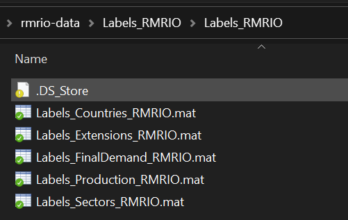

By default, this folder should contain the following files:

* `Labels_Countries_RMRIO.mat`
* `Labels_Extensions_RMRIO.mat`
* `Labels_FinalDemand_RMRIO.mat`
* `Labels_Production_RMRIO.mat`
* `Labels_Sectors_RMRIO.mat`

